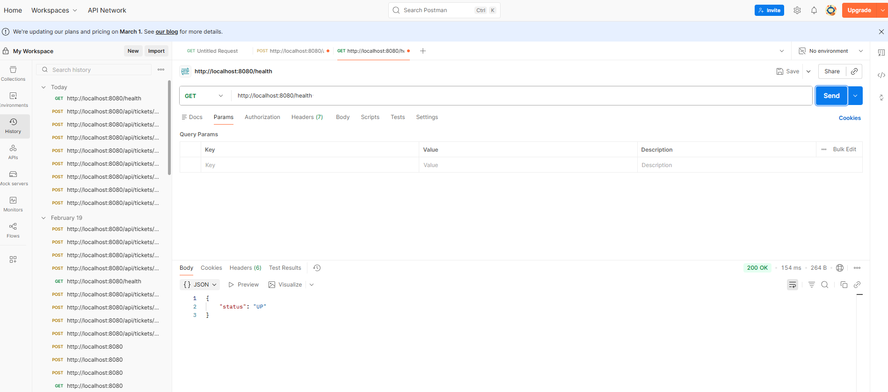
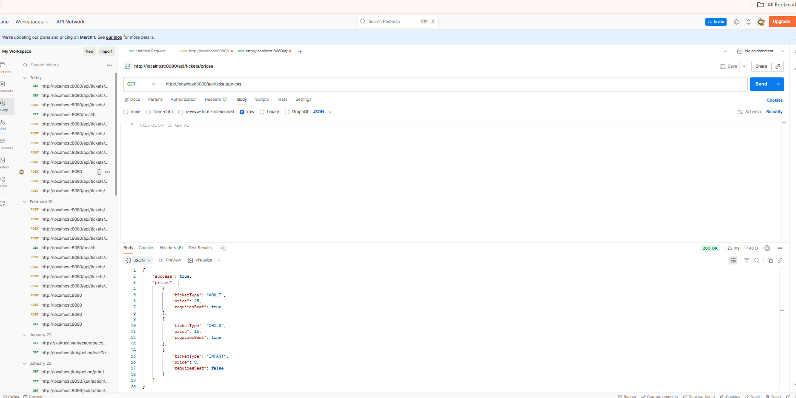
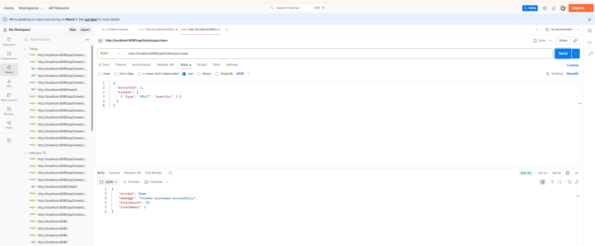
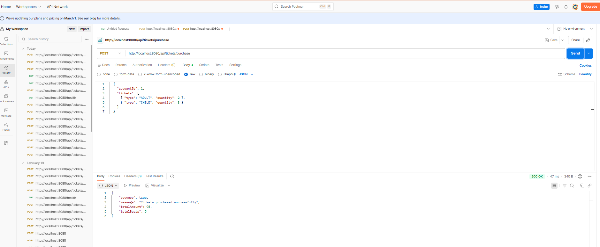
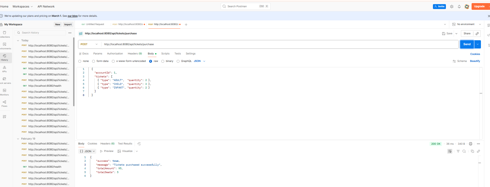
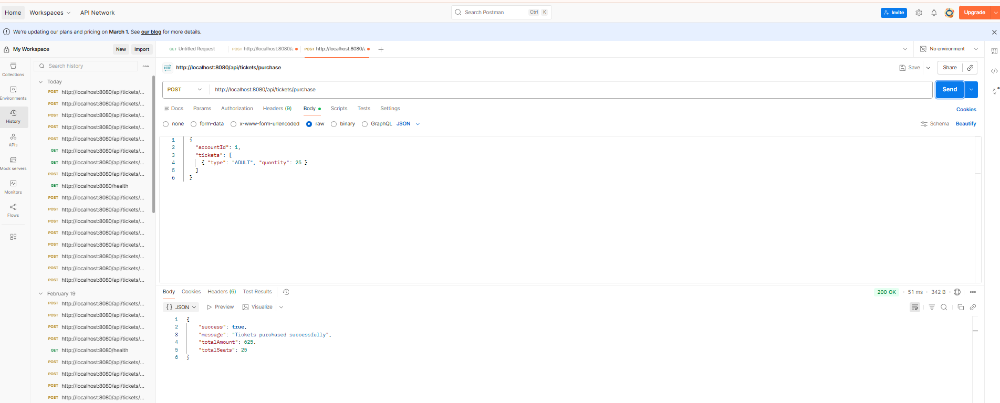
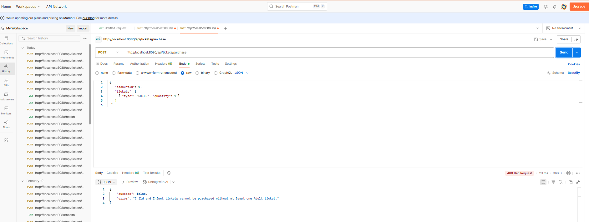
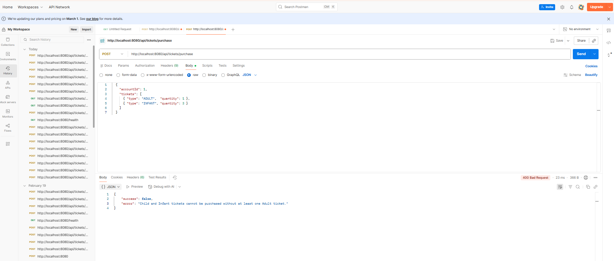
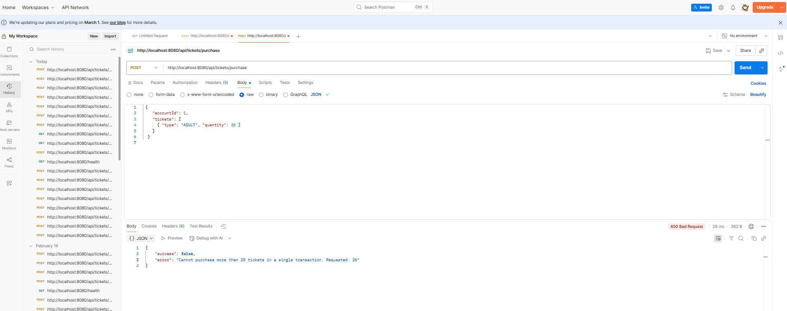
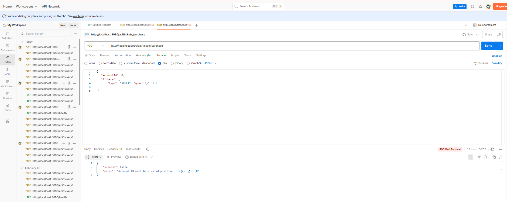

# Cinema Ticket Service

**Application ID: 15841369**

A Java implementation of `TicketService` for a cinema booking system.

---

## Ticket Prices

| Type   | Price | Seat Required |
|--------|-------|---------------|
| ADULT  | £25   | Yes           |
| CHILD  | £15   | Yes           |
| INFANT | £0    | No (sits on adult's lap) |

---

## Business Rules

1. **Account ID** must be a positive integer (`> 0`).
2. **At least one ticket** must be requested per transaction.
3. **Maximum 25 tickets** per single transaction.
4. **Child and Infant** tickets require at least one Adult ticket in the same request.
5. **Infants cannot exceed Adults** — each infant sits on one adult's lap.
6. **No negative quantities** are permitted.

---

## Architecture

```
src/main/java/
├── thirdparty/
│   ├── paymentgateway/
│   │   └── TicketPaymentService.java      # Third-party interface (read-only)
│   └── seatbooking/
│       └── SeatReservationService.java    # Third-party interface (read-only)
└── uk/gov/dwp/uc/pairtest/cinema/tickets/
    ├── domain/
    │   └── TicketTypeRequest.java         # Immutable value object
    ├── exception/
    │   └── InvalidPurchaseException.java  # Domain exception
    ├── TicketService.java                 # Public interface
    └── TicketServiceImpl.java             # Implementation  ← core logic here
```

---

## Running Tests

Requires **Java 17+** and **Maven 3.8+**.

```bash
mvn test
```

---

## Design Decisions

- **`TicketServiceImpl`** validates all inputs before making any external calls. If validation fails, neither the payment gateway nor the seat reservation service is invoked (atomicity of side-effects).
- Infant tickets cost **£0** and consume **no seat**.
- The `thirdparty` interfaces are treated as untouchable third-party contracts.
- Validation is separated into focused private methods (`validateAccountId`, `validateTicketRequests`, `validateBusinessRules`) to keep the public method readable and to allow targeted unit testing of each rule.


 GET http://localhost:8080/health


  GET http://localhost:8080/api/tickets/prices



http://localhost:8080/api/tickets/purchase
 1 Adult=>
  {
    "accountId": 1,
    "tickets": [
      { "type": "ADULT", "quantity": 1 }
    ]
  }


 2 Adults + 3 Children
  {
    "accountId": 1,
    "tickets": [
      { "type": "ADULT", "quantity": 2 },
      { "type": "CHILD", "quantity": 3 }
    ]
  }


  Mixed — Adults + Children + Infants
  {
    "accountId": 1,
    "tickets": [
      { "type": "ADULT",  "quantity": 2 },
      { "type": "CHILD",  "quantity": 3 },
      { "type": "INFANT", "quantity": 2 }
    ]
  }

  Max 25 tickets
  {
    "accountId": 1,
    "tickets": [
      { "type": "ADULT", "quantity": 25 }
    ]
  }



POST — Invalid requests (should return 400)

  No adult with child
  {
    "accountId": 1,
    "tickets": [
      { "type": "CHILD", "quantity": 1 }
    ]
  }

  More infants than adults
  {
    "accountId": 1,
    "tickets": [
      { "type": "ADULT",  "quantity": 1 },
      { "type": "INFANT", "quantity": 3 }
    ]
  }


 Over 25 tickets
  {
    "accountId": 1,
    "tickets": [
      { "type": "ADULT", "quantity": 26 }
    ]
  }


  Invalid account ID (zero)
  {
    "accountId": 0,
    "tickets": [
      { "type": "ADULT", "quantity": 1 }
    ]
  }
  